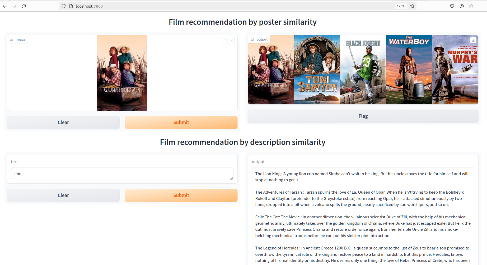

# Projet AIF

This gradio demo app has 2 functionnality : uploading a film poster and it recommands 5 similar posters or writing a description of a film and it recommands 5 similar film with their synopsis.     


## How to run
1. Install Docker and Docker compose
2. Clone this repository
3. Run `docker compose up` in the root directory of this repository
4. Open `localhost:7860` in your browser
5. Upload an image and see the results
6. To stop the server, run 
```docker-compose down``` in the root directory of this repository
7. To remove the containers, run `docker-compose rm` in the root directory of this repository
8. To remove the images, run `docker image prune -a` in the root directory of this repository

